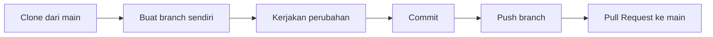

<div align="center" style="text-align: center;">

# 📚 PWEBL

**Repository praktikum kelompok — Pemrograman Web Lanjut**

Dibangun dengan [Laravel](https://laravel.com).

</div>

---

> [!IMPORTANT]
> Repository diambil dari branch **`main`**. Setiap anggota **wajib** membuat branch sendiri sebelum mengubah kode apa pun. **Jangan pernah** mengerjakan perubahan langsung di `main`.

> [!NOTE]
> Sebelum panduan ini dibagikan ke tim, pastikan source Laravel sudah ada di branch `main` (terdapat file `composer.json`). Jika repository masih kosong, `composer install` belum bisa dijalankan.

## 📑 Daftar Isi

1. [Alur Kerja](#-alur-kerja)
2. [Peralatan yang Dibutuhkan](#-peralatan-yang-dibutuhkan)
3. [Menginstal Git Bash](#1-menginstal-git-bash)
4. [Menginstal Laragon](#2-menginstal-laragon)
5. [Membuka Terminal Laragon](#3-membuka-terminal-laragon)
6. [Mengambil Project dari GitHub](#4-mengambil-project-dari-github)
7. [Membuat Branch Sendiri](#5-membuat-branch-sendiri)
8. [Menginstal Kebutuhan Laravel](#6-menginstal-kebutuhan-laravel)
9. [Menjalankan Project](#7-menjalankan-project)
10. [Menyimpan dan Mengirim Perubahan](#8-menyimpan-dan-mengirim-perubahan)
11. [Mengambil Perubahan Terbaru dari Main](#9-mengambil-perubahan-terbaru-dari-main)
12. [Mengatasi Error Umum](#-mengatasi-error-umum)
13. [Ringkasan Perintah](#-ringkasan-perintah)
14. [Aturan Penting](#-aturan-penting)

---

## 🔀 Alur Kerja



## 🧰 Peralatan yang Dibutuhkan

| Aplikasi               | Kegunaan                                             |
| ----------------------- | ----------------------------------------------------- |
| **Git**                 | Mengambil project dan mengelola branch                |
| **Git Bash**            | Terminal untuk menjalankan perintah Git                |
| **Laragon**              | Menyediakan PHP, Composer, web server, dan database    |
| **Composer**            | Menginstal package PHP milik project                   |
| **Visual Studio Code**  | Mengedit source code                                   |

---

## 1. Menginstal Git Bash

Git Bash diperoleh dengan menginstal **Git for Windows**.

1. Buka [Git for Windows](https://git-scm.com/download/win).
2. Pilih installer **Windows x64**.
3. Buka installer yang sudah diunduh.
4. Gunakan pengaturan bawaan, lalu tekan **Next** sampai muncul **Install**.
5. Tunggu sampai instalasi selesai.
6. Buka Git Bash dan periksa instalasinya:

   ```bash
   git --version
   ```

   Jika berhasil, terminal akan menampilkan versi Git.

## 2. Menginstal Laragon

Laragon menyediakan PHP dan Composer yang dibutuhkan Laravel — **tidak perlu diinstal terpisah**.

1. Buka halaman download [Laragon](https://laragon.org/download/).
2. Unduh Laragon untuk Windows.
3. Jalankan installer.
4. Gunakan lokasi instalasi bawaan:

   ```text
   C:\laragon
   ```
5. Aktifkan **Auto Virtual Hosts** jika tersedia.
6. Selesaikan instalasi dan buka Laragon.

## 3. Membuka Terminal Laragon

1. Buka Laragon.
2. Klik **Start All**.
3. Tunggu hingga Apache dan MySQL aktif.
4. Klik tombol **Terminal**.

Gunakan Terminal Laragon untuk langkah berikutnya karena PHP dan Composer sudah otomatis dikenali.

Periksa semua kebutuhan:

```bash
git --version
php --version
composer --version
```

Jika semuanya menampilkan nomor versi, lanjutkan ke proses clone.

## 4. Mengambil Project dari GitHub

### 4.1 Masuk ke folder Laragon

```bash
cd C:/laragon/www
```

Jika Laragon berada di drive `D`, sesuaikan menjadi:

```bash
cd D:/laragon/www
```

### 4.2 Clone repository

```bash
git clone https://github.com/EndricoPP/PWEBL.git
```

Perintah tersebut mengunduh repository dari default branch `main` ke folder `PWEBL`.

Masuk ke folder project:

```bash
cd PWEBL
```

Pastikan branch yang aktif adalah `main` dan ambil versi terbaru:

```bash
git switch main
git pull origin main
```

Periksa branch aktif:

```bash
git branch
```

Hasilnya kurang lebih:

```text
* main
```

## 5. Membuat Branch Sendiri

Setelah project diambil dari `main`, setiap anggota **harus** membuat branch masing-masing.

Format nama yang disarankan: `nama-anggota`

Contoh membuat branch bernama `endrico` sekaligus berpindah:

```bash
git switch -c endrico
```

Ganti `endrico` dengan nama branch masing-masing. Periksa kembali:

```bash
git branch
```

Contoh hasil:

```text
* endrico
  main
```

Simbol bintang (`*`) menunjukkan branch yang aktif. Pastikan simbol tersebut **tidak berada di `main`** ketika mulai mengubah kode.

Kirim branch baru ke GitHub:

```bash
git push -u origin endrico
```

Ganti `endrico` dengan nama branch yang dibuat. Opsi `-u` menghubungkan branch lokal dengan branch di GitHub sehingga push berikutnya cukup menggunakan `git push`.

## 6. Menginstal Kebutuhan Laravel

Repository hasil clone tidak membawa folder `vendor` dan biasanya tidak membawa file `.env`. Keduanya harus disiapkan di komputer masing-masing.

Pastikan terminal berada di folder project:

```bash
cd C:/laragon/www/PWEBL
```

### 6.1 Instal package PHP

```bash
composer install
```

Gunakan `composer install`, **bukan** `composer create-project`, karena project Laravel sudah tersedia di GitHub.

### 6.2 Buat file environment

```bash
cp .env.example .env
```

Jika file `.env` sudah tersedia, langkah ini dapat dilewati.

### 6.3 Buat application key

```bash
php artisan key:generate
```

### 6.4 Atur database

Buka file `.env` dan sesuaikan konfigurasi berikut:

```env
DB_CONNECTION=mysql
DB_HOST=127.0.0.1
DB_PORT=3306
DB_DATABASE=pwebl
DB_USERNAME=root
DB_PASSWORD=
```

Buat database bernama `pwebl` melalui phpMyAdmin atau aplikasi pengelola database yang digunakan.

Jalankan migration:

```bash
php artisan migrate
```

Jika project menyediakan seeder dan memang perlu digunakan:

```bash
php artisan migrate --seed
```

> [!CAUTION]
> Jangan menjalankan `php artisan migrate` pada database yang berisi data penting karena seluruh tabel akan dihapus.

### 6.5 Instal kebutuhan frontend

Jika project menggunakan Vite:

```bash
npm install
npm run dev
```

Biarkan terminal `npm run dev` tetap terbuka. Gunakan Terminal Laragon baru untuk menjalankan Laravel.

## 7. Menjalankan Project

```bash
cd C:/laragon/www/PWEBL
php artisan serve
```

Buka [http://127.0.0.1:8000](http://127.0.0.1:8000).

Tekan `Ctrl + C` untuk menghentikan server.

Project juga dapat dibuka menggunakan URL otomatis Laragon:

```text
http://pwebl.test
```

Jika URL belum aktif, klik **Menu > Reload** atau jalankan ulang **Start All**.

Untuk membuka project di Visual Studio Code:

```bash
code .
```

## 8. Menyimpan dan Mengirim Perubahan

Periksa branch aktif:

```bash
git branch
```

Pastikan branch sendiri yang memiliki simbol bintang, **bukan** `main`.

Periksa file yang berubah:

```bash
git status
```

Simpan perubahan dan buat commit:

```bash
git add .
git commit -m "Menambahkan fitur nama-fitur"
```

Kirim perubahan:

```bash
git push
```

Jika branch belum pernah dikirim ke GitHub:

```bash
git push -u origin nama-branch
```

Setelah push berhasil, buat **Pull Request** dari branch masing-masing menuju branch `main` melalui GitHub.

## 9. Mengambil Perubahan Terbaru dari Main

Sebelum memulai pekerjaan baru, perbarui `main`:

```bash
git switch main
git pull origin main
```

Kembali ke branch sendiri dan gabungkan versi terbaru `main`:

```bash
git switch nama-branch
git merge main
```

Contoh untuk branch `endrico`:

```bash
git switch main
git pull origin main
git switch endrico
git merge main
```

Jika muncul konflik, selesaikan bagian yang bertanda konflik di Visual Studio Code sebelum melakukan commit.

---

## 🛠️ Mengatasi Error Umum

<details>
<summary><b>Folder <code>PWEBL</code> sudah tersedia</b></summary>

Jika muncul pesan `destination path 'PWEBL' already exists`, jangan clone lagi. Jalankan:

```bash
cd C:/laragon/www/PWEBL
git switch main
git pull origin main
```

</details>

<details>
<summary><b>Composer tidak ditemukan</b></summary>

Pastikan perintah dijalankan melalui Terminal Laragon. Tutup terminal lama, restart Laragon, kemudian buka Terminal kembali.

</details>

<details>
<summary><b>File <code>composer.json</code> tidak ditemukan</b></summary>

Pastikan source Laravel sudah diunggah ke branch `main` dan terminal berada di folder `PWEBL`. Periksa dengan:

```bash
git switch main
git pull origin main
ls
```

Jika `composer.json` tetap tidak ada, berarti source Laravel belum tersedia di repository dan harus diunggah oleh pemilik repository terlebih dahulu.

</details>

<details>
<summary><b>Application key belum tersedia</b></summary>

```bash
php artisan key:generate
```

</details>

<details>
<summary><b>File <code>.env.example</code> tidak ditemukan</b></summary>

Pastikan terminal sudah berada di folder `PWEBL`:

```bash
pwd
ls
```

</details>

<details>
<summary><b>Gagal push ke GitHub</b></summary>

Pastikan akun GitHub memiliki akses push ke repository. Jika belum, minta pemilik repository menambahkan akun tersebut sebagai collaborator.

</details>

<details>
<summary><b>Port 8000 sedang digunakan</b></summary>

```bash
php artisan serve --port=8001
```

Kemudian buka [http://127.0.0.1:8001](http://127.0.0.1:8001).

</details>

---

## 📋 Ringkasan Perintah

**Pertama kali mengambil project**

```bash
cd C:/laragon/www
git clone https://github.com/EndricoPP/PWEBL.git
cd PWEBL
git switch main
git pull origin main
git switch -c nama-branch
composer install
cp .env.example .env
php artisan key:generate
php artisan migrate
git push -u origin nama-branch
php artisan serve
```

**Mulai bekerja pada hari berikutnya**

```bash
cd C:/laragon/www/PWEBL
git switch main
git pull origin main
git switch nama-branch
git merge main
php artisan serve
```

**Setelah selesai mengerjakan perubahan**

```bash
git status
git add .
git commit -m "Menambahkan fitur nama-fitur"
git push
```

---

## ✅ Aturan Penting

- [X] Selalu mengambil dan memperbarui project dari branch `main`.
- [X] Jangan mengubah kode langsung di branch `main`.
- [X] Setiap anggota menggunakan branch sendiri.
- [X] Jalankan `git pull origin main` sebelum memulai pekerjaan.
- [X] Periksa branch aktif menggunakan `git branch`.
- [X] Push perubahan hanya ke branch sendiri.
- [X] Gabungkan perubahan ke `main` melalui Pull Request.

<p align="center">Dibuat untuk tim <b>PWEBL</b> ❤️</p>
